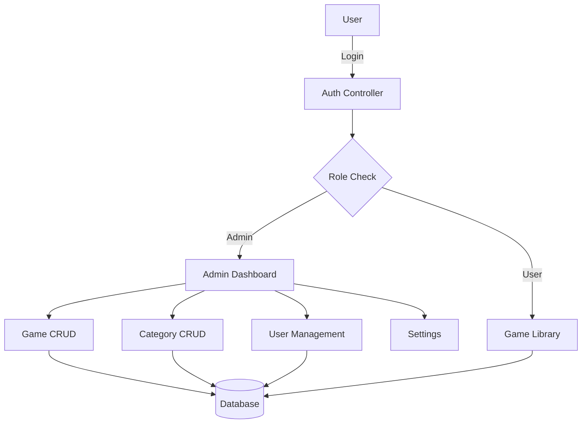

<p align="center">
  
</p>

<h1 align="center">🎮 Zingames</h1>

<p align="center">
  <b>A modern Laravel-based web app for managing and playing games, with a powerful admin panel.</b><br>
  <a href="#table-of-contents">Table of Contents</a> • <a href="#features">Features</a> • <a href="#installation">Installation</a> • <a href="#usage">Usage</a> • <a href="#screenshots">Screenshots</a> • <a href="#api-documentation">API</a> • <a href="#contributing">Contributing</a>
</p>

---

## 🗂️ Table of Contents
- [🗂️ Table of Contents](#️-table-of-contents)
- [📝 About](#-about)
- [🚀 Features](#-features)
- [🖥️ Tech Stack](#️-tech-stack)
- [🏗️ Architecture](#️-architecture)
- [📁 Folder Structure](#-folder-structure)
- [⚙️ Installation](#️-installation)
  - [1. Clone the repository](#1-clone-the-repository)
  - [2. Install dependencies](#2-install-dependencies)
  - [3. Environment setup](#3-environment-setup)
- [🌱 Environment Setup](#-environment-setup)
- [🗄️ Database Setup](#️-database-setup)
- [🔑 Admin Logins](#-admin-logins)
- [💡 Usage](#-usage)
- [📸 Screenshots](#-screenshots)
- [📚 API Documentation](#-api-documentation)
  - [Get All Games](#get-all-games)
  - [Create a New Game](#create-a-new-game)
  - [Get All Categories](#get-all-categories)
  - [Lock a User](#lock-a-user)
- [🧑‍💻 User Stories](#-user-stories)
- [🧩 UI Components](#-ui-components)
- [🛠️ Advanced Configuration](#️-advanced-configuration)
- [🧪 Testing](#-testing)
- [❓ FAQ](#-faq)
- [🔒 Security](#-security)
- [🤝 Contributing](#-contributing)
- [📝 Changelog](#-changelog)
- [🙏 Credits](#-credits)
- [📄 License](#-license)
- [📞 Project Access \& Contact](#-project-access--contact)
- [📬 Contact](#-contact)

---

## 📝 About
Zingames is a robust, scalable, and modern web application built with Laravel. It provides a feature-rich admin panel for managing games, categories, and users, with advanced security and role-based access control. Perfect for game libraries, educational platforms, or any project needing user and content management.

---

## 🚀 Features
- 🎛️ **Admin Panel**: Manage users, games, categories, and messages
- 🕹️ **Game Management**: CRUD for games and categories
- 🔒 **Secure Authentication**: Admin roles, account lockout, 2FA ready
- 🛡️ **Role & Permission System**: Fine-grained access control
- 📊 **Dashboard**: Stats, recent activity, and quick actions
- 🗄️ **Database Migrations & Seeding**: Easy setup and test data
- 🌐 **Responsive UI**: Works on desktop and mobile
- 📝 **Extensive Documentation**: For easy onboarding
- 🧑‍💻 **API Ready**: Easily extendable for RESTful APIs
- 🧩 **Modular Codebase**: Clean, maintainable, and scalable
- 🖼️ **Modern UI/UX**: Built with Bootstrap and custom components
- 🧪 **Testing Suite**: PHPUnit and feature tests included

---

## 🖥️ Tech Stack
- [Laravel](https://laravel.com/) (PHP)
- [MySQL](https://www.mysql.com/)
- [Blade](https://laravel.com/docs/10.x/blade) (views)
- [Bootstrap](https://getbootstrap.com/) (UI)
- [JavaScript](https://developer.mozilla.org/en-US/docs/Web/JavaScript)
- [Composer](https://getcomposer.org/)
- [NPM](https://www.npmjs.com/)
- [PHPUnit](https://phpunit.de/) (testing)
- [Mailtrap](https://mailtrap.io/) (email testing)

---

## 🏗️ Architecture


---

## 📁 Folder Structure
```text
zingames/
├── app/
│   ├── Console/
│   ├── Exceptions/
│   ├── Http/
│   │   ├── Controllers/
│   │   ├── Middleware/
│   ├── Models/
├── bootstrap/
├── config/
├── database/
│   ├── factories/
│   ├── migrations/
│   ├── seeders/
├── public/
│   ├── img/
│   ├── index.php
├── resources/
│   ├── views/
│   ├── js/
│   ├── css/
├── routes/
├── storage/
├── tests/
├── .env.example
├── composer.json
├── package.json
├── README.md
```

---

## ⚙️ Installation

### 1. Clone the repository
```bash
git clone https://github.com/yourusername/zingames.git
cd zingames
```

### 2. Install dependencies
```bash
composer install
npm install
```

### 3. Environment setup
- Copy `.env.example` to `.env` and update your DB credentials:
```bash
cp .env.example .env
```
- Generate app key:
```bash
php artisan key:generate
```

---

## 🌱 Environment Setup
Example `.env` variables:
```env
APP_NAME=Zingames
APP_ENV=local
APP_KEY=base64:...
APP_DEBUG=true
APP_URL=http://localhost
DB_CONNECTION=mysql
DB_HOST=127.0.0.1
DB_PORT=3306
DB_DATABASE=zingames
DB_USERNAME=root
DB_PASSWORD=yourpassword
```

---

## 🗄️ Database Setup
- Create a MySQL database (e.g., `zingames`)
- Run migrations:
```bash
php artisan migrate
```
- Seed admin users:
```bash
php artisan db:seed --class=AdminUserSeeder
```

---

## 🔑 Admin Logins
| Name      | Email                     | Password     | Role        |
|-----------|--------------------------|--------------|-------------|
| Sub Admin | subadmin@zingames.com    | subadmin123  | admin       |

> ⚠️ **Change passwords after first login for security!**

---

## 💡 Usage
- Start the server:
  ```bash
  php artisan serve
  ```
- Visit [http://localhost:8000](http://localhost:8000)
- Admin panel: `/admin/dashboard` (login required)
- Manage games, categories, users, and messages from the admin panel
- Use the search bar to quickly find games or users
- Filter games by category or popularity
- Lock/unlock users from the admin panel for security
- View dashboard stats for quick insights
- Customize permissions for sub-admins

---

## 📸 Screenshots
> _Add your app screenshots here for a better showcase!_

<p align="center">
  
  <!--  -->
  <!--  -->
</p>

---

## 📚 API Documentation
> _If your project exposes APIs, document them here. Example below:_

### Get All Games
```http
GET /api/games
```
**Response:**
```json
[
  { "id": 1, "name": "Chess", "category": "Board" },
  { "id": 2, "name": "Sudoku", "category": "Puzzle" }
]
```

### Create a New Game
```http
POST /api/games
```
**Body:**
```json
{
  "name": "Ludo",
  "category_id": 3
}
```

### Get All Categories
```http
GET /api/categories
```
**Response:**
```json
[
  { "id": 1, "name": "Board" },
  { "id": 2, "name": "Puzzle" }
]
```

### Lock a User
```http
POST /api/users/{id}/lock
```
**Body:**
```json
{
  "minutes": 30
}
```

---

## 🧑‍💻 User Stories
- As an admin, I want to add new games so that users always have fresh content.
- As a user, I want to play games without registration.
- As a admin, I want to lock/unlock any account for security.
- As a developer, I want to easily extend the platform with new features.

---

## 🧩 UI Components
- **Navbar**: Responsive, with search and user menu
- **Sidebar**: For quick admin navigation
- **Dashboard Cards**: Stats, recent logins, quick actions
- **Game Cards**: Image, title, category, play button
- **User Table**: Sort, filter, lock/unlock actions
- **Forms**: For adding/editing games, categories, users
- **Modals**: For confirmations and quick edits
- **Alerts**: Success, error, info messages

---

## 🛠️ Advanced Configuration
- **Mail Setup**: Configure SMTP in `.env` for email notifications
- **Queue Setup**: Use Laravel queues for background jobs
- **Cache**: Use Redis or Memcached for performance
- **Custom Permissions**: Add new permissions in the `permissions` array
- **Localization**: Ready for multi-language support

---

## 🧪 Testing
- Run all tests:
  ```bash
  php artisan test
  ```
- Feature tests for authentication, CRUD, and permissions
- Use [Mailtrap](https://mailtrap.io/) for email testing
- Add your own tests in `tests/Feature` and `tests/Unit`

---

## ❓ FAQ
**Q: How do I reset an admin password?**
> Use the password reset feature on the login page or update via tinker.

**Q: How do I add more permissions?**
> Update the `permissions` array in the user model or via the admin panel.

**Q: Can I deploy this on shared hosting?**
> Yes, just make sure PHP, Composer, and MySQL are available.

**Q: How do I add a new admin?**
> Use the admin panel or seeders, or run a tinker command.

**Q: How do I update the UI theme?**
> Edit the Blade templates and Bootstrap variables in `resources/views` and `resources/css`.

**Q: How do I backup the database?**
> Use `mysqldump` or Laravel's backup packages.

**Q: How do I enable 2FA?**
> Set up the `two_factor_enabled` field in the user model and integrate a package like Google Authenticator.

**Q: How do I contribute?**
> Fork the repo, create a branch, make changes, and open a pull request!

---

## 🔒 Security
- All passwords are hashed using bcrypt
- Account lockout after multiple failed attempts
- Role-based access control
- Regularly update dependencies for security
- Use HTTPS in production
- Validate all user input
- Use Laravel's built-in CSRF protection
- Monitor logs for suspicious activity

---

## 🤝 Contributing
1. Fork the repository
2. Create your feature branch (`git checkout -b feature/YourFeature`)
3. Commit your changes (`git commit -am 'Add new feature'`)
4. Push to the branch (`git push origin feature/YourFeature`)
5. Open a Pull Request

**Code Style:**
- Follow PSR-12 for PHP
- Use meaningful commit messages
- Write tests for new features
- Document your code and features

---

## 📝 Changelog
- **v1.0.0** - Initial release
- **v1.1.0** - Added advanced admin features
- **v1.2.0** - Improved UI/UX and added more tests
- _Add your changes here_

---

## 🙏 Credits
- [Laravel](https://laravel.com/)
- [Bootstrap](https://getbootstrap.com/)
- [FontAwesome](https://fontawesome.com/)
- [Mailtrap](https://mailtrap.io/)
- All contributors and testers

---

## 📄 License
[MIT](LICENSE)

---

## 📞 Project Access & Contact
Agar aapko **Zingames** project ki source code, demo, ya deployment chahiye ho, toh niche diye gaye contact details par humse sampark karein:

- 📧 Email: [sauravpatil212@gmail.com](mailto:sauravpatil212@gmail.com)
- 🌐 Website: [sauravpatil.rf.gd](http://sauravpatil.re.gd)
- 📱 Phone/WhatsApp: 9879435012

> **Note:** Project ka access sirf request par diya jayega. Business, academic, ya personal use ke liye contact karein!

---

## 📬 Contact
- Project Maintainer: [Saurav Patil](mailto:sauravpatil212@gmail.com.com)
- For support, open an issue or contact the repository owner.

---

